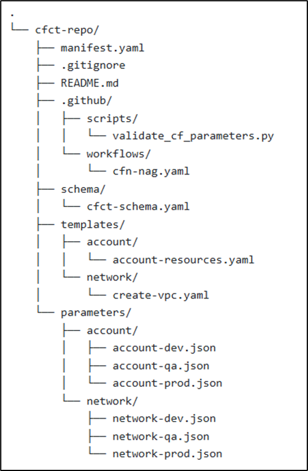

# CFN Nag Scan Workflow

## Overivew
This folder includes a GitHub Actions workflow that performs automated validation and security checks on CloudFormation templates, parameter files, and the project’s manifest.yaml. The workflow is designed to prevent misconfigurations, detect security issues early, and ensure consistent structure across CfCT-based deployments prior to running the CfCT Pipeline.

## 📌 What This Workflow Does

The workflow runs on all pushes and pull requests to any branch.

It performs the following checks:

1. Validate manifest.yaml Syntax

- Uses pykwalify and pyyaml to validate the manifest against a schema.
- Ensures structural correctness before proceeding.

2. Discover Parameter Files

- Parses manifest.yaml to extract all parameter_file entries.
- Exposes them via GITHUB_OUTPUT for later steps.
- Automatically handles cases where none are present.

3. Validate Parameter File JSON

- Validates JSON syntax for each discovered parameter file.
- Uses python3 -m json.tool for linting.
- Fails fast if any JSON is invalid.

4. Detect Changed CloudFormation Templates

- Uses tj-actions/changed-files to detect which CloudFormation files have been modified:

--> templates/**/*.yaml
--> templates/**/*.yml
--> templates/**/*.json

5. Run CFN-Nag on Modified Templates

- Installs cfn-nag (Ruby gem).
- Scans only the templates that changed in the pull request.
- Warns of insecure CloudFormation patterns in templates.

6. Validate Parameters Against Templates

- Matches parameter files to templates based on directory patterns:

--> parameters/account/\*.json → templates/account/account-resources.yaml 
--> parameters/network/\*.json → templates/network/create-vpc.yaml

- Uses the custom script:

--> .github/scripts/validate_cf_parameters.py

- Warns when a parameter file has no matching template.

## 🧱 Workflow File Location

This workflow should be stored within the following structure:

- .github/workflows/cfn-nag.yaml

## ⚙️ Workflow Overview

The workflow uses Ubuntu runners and performs a full CI pipeline for CloudFormation linting and security scanning.

### 🛡️ Purpose of Each Major Step

| Step                                   | Purpose                                                   |
|----------------------------------------|-----------------------------------------------------------|
| Validate manifest.yaml                 | Ensures CfCT manifest is structurally correct            |
| Discover parameter files               | Finds all JSON parameter files referenced in manifest    |
| Validate JSON                          | Prevents malformed parameter files                       |
| Detect changed templates               | Makes CFN-Nag scan efficient                             |
| Run CFN-Nag                            | Detects insecure IAM, S3, Security Groups, etc.          |

## ✔️ Requirements

This workflow expects:

- A valid manifest.yaml at the root.
- YAML schema located at: schema/cfct-schema.yaml
- CloudFormation templates organized under the templates/ directory.
- Parameter files stored under parameters/ in folder-based groups.

Script for validation located at:

--> .github/scripts/validate_cf_parameters.py

## 📁 Repository Structure (Example)

